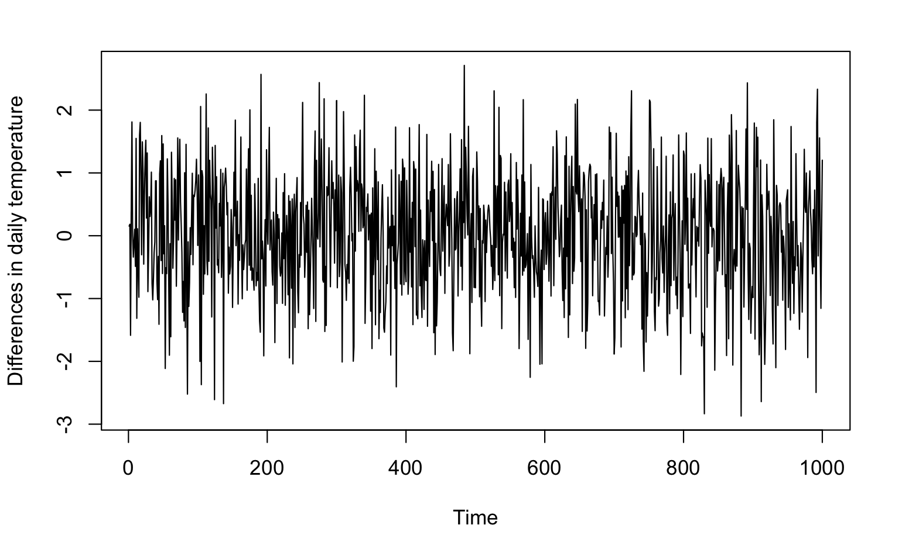
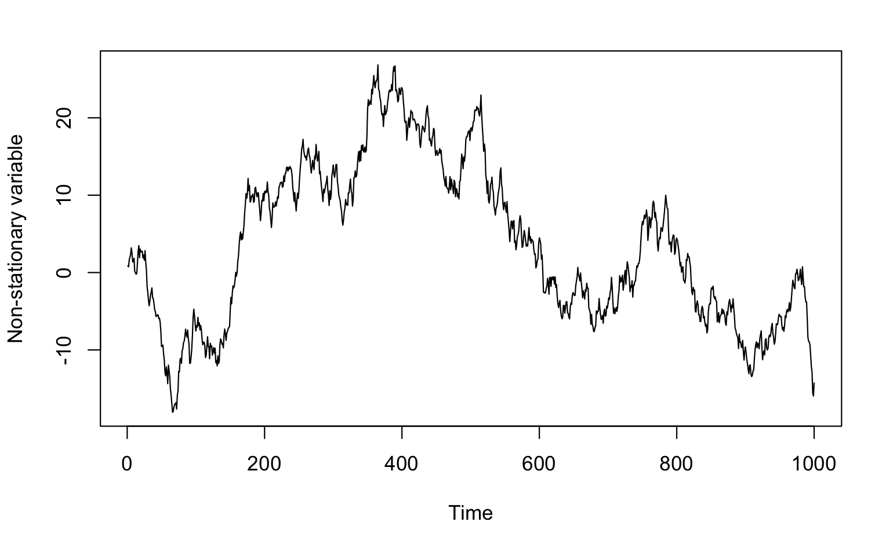

```{r setup, include=FALSE}
knitr::opts_chunk$set(echo = TRUE)
```

# Time Series Tutorial

## 

## What is Time series data?

-   A set of observations on the values that a variable takes at regular time intervals.

-   A univariate time series (a single variable over time): **X~1~, X~2~, ... X~t~**\
    where ***t*** is the time and ***X~t~*** is the value of the time series at a particular point.

### Examples:

-   Weather forecast (daily temperature in Merced)

-   Business (sales and prices)

-   Economics (minute changes in stock market)

-   Neuroscience (EEG)

-   Ups and downs of relationship over time

-   Changes in the ecosystem of a lake over time

-   And more ...

## What is time series analyses?

-   Understanding how a metric changes over time.

-   Forecasting future changes.

### Key concepts:

### **1- Autocorrelation**

Autocorrelation refers to the degree of similarity between a given time series and a lagged version of itself over successive time intervals.

**X~t = Merced temperature today~**

**X~t-1 = Merced temperature a day ago~**

**X~t-2 = Merced temperature two days ago~**

(The number represents the lag or the period apart between pairs of observations)

**Why should we care?** Autocorrelation helps us study how each time series observation is related to its recent past. (Hint: early warning signals!)

### 2- Stationarity

For some time series analyses, we assume that the statistical properties (mean, variance, autocorrelation) of a time series do not change over time.

[It does not mean that the series does not change over time, just that the *way* it changes does not itself change over time.]{.ul}



A stationary series should show random oscillation around the mean.

However, the same type of random behavior often holds from one time period to the next. For example, Merced temperature may have different behavior from the previous year. But the mean, standard deviation, and other statistical properties are often similar from one year to the next.



**Why should we care?**

A stationary process can be modeled with fewer parameters and makes things easier!

## Getting started with R...

### Data: Mathematical Insight


```{r}
##What does the data look like?
library(tidyverse)
experts_and_insights <- read_csv("experts_insights_combined.csv")
Tutorial_data<- experts_and_insights %>%
select(subName, problemName, start, obNew, Event ) %>%
arrange(subName, problemName,start)

head(Tutorial_data, 5)
tail(Tutorial_data, 5)

```

```{r}
Tutorial_data %>% 
filter(subName == "Dami", Event=="insight")%>%
print()

```

### What are we investigating?

Is there a change in the way one interacts with notations right before the insight occurs? is there a change in the attentional shifts before insight?

Would we see more variability 30s prior to insight compared to random 30-second slices?

```{r}
## Loading cool packages:
library(magrittr)
library(tidyverse)
library(scales)
library(gridExtra)
theme_set(theme_classic())

```

## Data Examination:

The first question to ask: Is my data stationary?

Three ways to find out:

1- Visualize the time series **plot** and look for constant mean and variance:

```{r}
Dami<- Tutorial_data%>%
  filter(subName== "Dami", problemName == "Function")

```

```{r}
plot(Dami$start/1000, type= "l", xlab = "Time", ylab="Attention shifts/ms")
```

2- Look at the **autocorrelation plot**. For stationary data, the correlation between the time series across successive lags should approach 0 very quickly.

```{r}
acf(Dami$start/1000, main = "Autocorrelation Plot")

```

3- Perform **unit root hypothesis test**,such as the augmented Dickey-Fuller test (ADF). The null hypothesis is non-stationarity but the alternative hypothesis is stationarity.

```{r}
cat("ADF test not run in this GitHub version because the tseries package is not installed in this environment.\n")
```

The null cannot be rejected. Obviously, this data is not stationary. What can we do?

## Data Preparation

### Making data stationary: Differencing

It can be used to remove the series dependence on time (the linear trend of time).

Differencing can help stabilize the mean of the time series.

Differencing is performed by subtracting the previous observation from the current observation:

***X~t~*****−*X~t−1~***.

```{r}
#Differencing in R
Dami_diff <-Dami %>% 
mutate(first_diff=c(NA, diff(start, 1, 1))) %>%
print()


```

```{r}
Dami_diff %>% ggplot( aes(x=start/1000, y=first_diff)) + 
  geom_line() + ylab("Shifts in attention") + xlab("Time")

```

```{r}
acf(na.omit(Dami_diff$first_diff), main = "Autocorrelation Plot")


```

```{r}
Dami_diff_na<- na.omit(Dami_diff)
cat("ADF test not run in this GitHub version because the tseries package is not installed in this environment.\n")

```

## Data Analyses

```{r}
Dami_diff%>%
  ggplot(aes(x=start/1000, y=first_diff)) + 
  geom_line() + 
  geom_vline( data=Dami_diff %>% 
  filter(Event== "insight"),aes(xintercept=start/1000, linetype= 'dashed', color='red')) + 
  ylab("Shifts in Attention") +
  xlab("Time/s")+
  ggtitle("The insight moment in the time series")+
  theme_classic()

```

1- We need to calculate a variability measure, like SD, for an insight moment and 30 seconds prior.

2- We need a frame of reference for the insight slice. So, we have to make a distribution of, let's say 1000, SDs for random 30 second slices in our data.

3- We then compare the insight SD to the distribution to see if it is any different.

```{r, results='hide'}
#Calculating the sd for Dami's insight slice:
sd_insights_demo<-tibble()
    for (i in 1:length(Dami_diff$first_diff)){
      if (Dami_diff$Event[i] == "insight"){ 
        insight_moment <- Dami_diff[i,]
        prior_insight <- insight_moment$start - 30000 
        slice <- Dami_diff %>% filter(start <= insight_moment$start &  start  >= prior_insight)
        SD_Prior_ins<- sd(slice$first_diff,na.rm = TRUE) 
        sd_insights_demo <- bind_rows(sd_insights_demo, tibble(sd=SD_Prior_ins)) 
      }
    }  
    
```

```{r, results='hide'}
sd_insights_demo

```

```{r, results='hide'}
#Simulating a distribution of SDs based on Dami's data:

sd_dist_demo<-tibble()
    for (i in 1:1000){
      random<-sample(Dami_diff$start, 1)
      prior<- random - 30000
      slice <- Dami_diff %>% filter(start <= random & start >= prior)
      SD_Prior<- sd(slice$first_diff,na.rm = TRUE)
      print(SD_Prior)
      sd_dist_demo <- bind_rows(sd_dist_demo, tibble(iteration=i,sd=SD_Prior))
    }


```

```{r}
#Make an empirical cumulative distribution based on the observed data:

ecdf_Dami<- ecdf(sd_dist_demo$sd)

plot(ecdf_Dami)
abline(v=1869.728, col="red", lty="dashed") #percentile for the insight sd

```

```{r}
#the estimated probability that the area of a sample is less than or equal to 1869 is about 0.52.

ecdf_Dami(1869.728) 
```

Maybe 30 second slides are very large, and we should check shorter window sizes.

The possibilities are infinite! You could do entropy....

Remembering some methodologies used in articles we have been reading.

## Modeling and Forecast

-   **Autoregressive models (AR):**

    -   *Predictor: past values (lags or p) of the time series variable* .

    -   Today's observation is regressed on yesterday's observation.

    -   The main parameter is the number of lags or p.

-   **Moving average models (MA):**

    -   Predictor: the past noise!

    -   Today's observation is regressed on yesterday's noise.

    -   The main parameter to include is q or the number of past random noises.

-   **Autoregressive Moving Average Models (ARMA)**

    -   Main parameters: q and p

-   **Autoregressive integrated Average Models (ARIMA)**

    -   parameters: q,d,p

### Example:

```{r}
##Cookie sale data
Cookie<-BJsales

```

```{r}
#The number of cookies that were sold in the last 150 days
head(Cookie,5)
```

```{r}
plot(Cookie, ylab="Number of sold cookies", xlab="days")
```

### Check for parameters (p,d,q):

```{r}
#Check for AR terms (p): the slope suggests that we should include at least one lag.
acf(Cookie, main = "Autocorrelation Plot")
```

```{r}
#Check for MA terms (q): the one significant line indicates one MA term (lagged noise or q).
#computes the correlation adjusting for previous lags/periods 
pacf(Cookie, main = "Partial Autocorrelation Plot")
```

### Fit the AR model:

```{r}
cookie_model<- arima(Cookie, order = c(1, 1, 1))
print(cookie_model)

#ar1: coefficient for a lag of one. It's 0.88: You can predict today's value from yesterday's value.
#The closer to one, the more predictable.
#ma1: lags of the forecast errors.
#There are measures such as log likelihood and aic for fit comparison.

```

### Check the model fit:

```{r}
#the model does a good job predicting currrent values from the previous one
ts.plot(Cookie)
AR_fitted_2 <- Cookie - residuals(cookie_model)
points(AR_fitted_2, type = "l", col = 2, lty = 2)
```

```{r}
#The residuals are behaving well.
Box.test(residuals(cookie_model), type ="Ljung-Box", lag=1)
```

```{r}
#residuals are behaving well
acf(residuals(cookie_model), main = "Residual Autocorrelation Plot")

```

### Forecasting:

```{r}
cookie_forecast <- predict(cookie_model, n.ahead = 5)
plot(cookie_forecast$pred, type = "o", pch = 16,
     xlab = "Forecast Horizon", ylab = "Predicted Sales",
     main = "Five-Step Forecast")
```


## Useful sources:

Data Camp course: [Time series analyses in R](https://learn.datacamp.com/courses/time-series-analysis-in-r)

Coursera course: [Intro to time series analyses in R](https://www.coursera.org/projects/intro-time-series-analysis-in-r)

Intro to time series: <https://www.aptech.com/blog/introduction-to-the-fundamentals-of-time-series-data-and-analysis/>

Autocorrelation: <https://dganais.medium.com/autocorrelation-in-time-series-c870e87e8a65>

Stationarity: <https://otexts.com/fpp2/stationarity.html>

Modeling: <https://towardsdatascience.com/the-complete-guide-to-time-series-analysis-and-forecasting-70d476bfe775>
